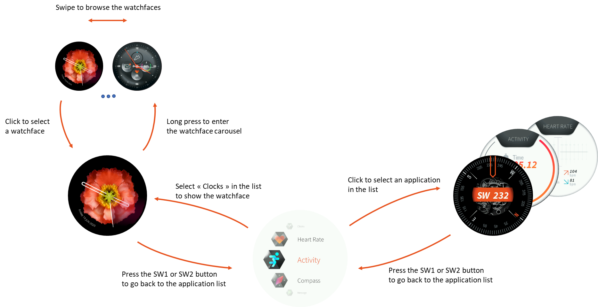

# Overview
This project is a wearable-like application. The aim of this application is to demonstrate the capability of MicroEJ to be the software enabler of available IP in various MCU/MPU/SoC such as hardware graphic processor unit (GPU).

The application uses [MicroUI](https://docs.microej.com/en/latest/ApplicationDeveloperGuide/UI/MicroUI/index.html) and [MicroVG](https://docs.microej.com/en/latest/ApplicationDeveloperGuide/UI/MicroVG/index.html) to exploit hardware's vector capabilities and to make a nice-looking/efficient user interface.

The GPU features used by this application are:
- Blit
- Vector Graphics path with fixed color
- Vector graphics path with gradient
- Matrix transformation (translate, rotate, scale)

# Content
The demo is composed of multiple wearable-inspired tiny applications:
- "Flower" watch face, an elegant face with:
   - vector hands
   - "radar-effect" gradient
   - curved vector text
- "Sport" watch face, a fitness face with:
   - vector hands
   - vector texts
- "Flower Lowpower" watch face, an elegant face with:
   - vector hands
   - refresh on every seconds to demonstrate platform lowpower feature
   - request to bsp of POWER_SAVING performance profile
- "Heart Rate", a heart rate tracker with:
   - vector line chart with multiple layers of gradients
   - vector texts
- "Activity", an activity monitor with:
   - vector circular progress bars with gradient
   - vector text with gradient
- "Compass", a compass with:
   - vector text
- "Vector Mascot", a technical demo of complex vector path
- "Vector CircleArc", a technical demo of vector circle arcs
- "VG Font", a technical demo of vector texts
- "Settings", a page for setting various options (languages, etc.)

# Application Flow
On startup, the application displays the Flower Watchface.

The user can do the following actions:
- A long touchscreen press to enter the watchface carousel.
- A user button press to enter the application list.

The watchface carousel lets the user select one of the three watchfaces available. To change the watchface, the user shall use the touchscreen to swipe to the left or to the right and then press shortly to enter the desired watchface.

The application list lets the user select one of the available applications. To change the application, the user shall use the touchscreen to swipe to the top or to the bottom and then press shortly to enter the desired application.

The user can come back to the application list from any application by pressing any user button.

When entering the clocks application, the last selected watchface is displayed.

Following is the flow chart of the application:

   
# Usage

The main class is [Demo.java](src/main/java/com/microej/Demo.java).

Two launchers are available:
- `DemoWearableVG (SIM)`: launches the demo on the simulator of the [i.MX RT595 EVK](https://www.nxp.com/design/development-boards/i-mx-evaluation-and-development-boards/i-mx-rt595-evaluation-kit:MIMXRT595-EVK) board.
- `DemoWearableVG (EMB)`: builds a binary of the demo for the [i.MX RT595 EVK](https://www.nxp.com/design/development-boards/i-mx-evaluation-and-development-boards/i-mx-rt595-evaluation-kit:MIMXRT595-EVK) board.

i.MX RT595 EVK VEE Port is available on [nxp-vee-imxrt595-evk](https://github.com/MicroEJ/nxp-vee-imxrt595-evk) repository.

# Requirements

This library requires the following Foundation Libraries:

    EDC-1.3 BON-1.4 MICROUI-3.0 MICROVG-1.1

# Dependencies
_All dependencies are retrieved transitively by Ivy resolver_.

# Source
N/A

# Restrictions
None.
  
---
_Copyright 2019-2023 MicroEJ Corp. All rights reserved._  
_Use of this source code is governed by a BSD-style license that can be found with this software._  
